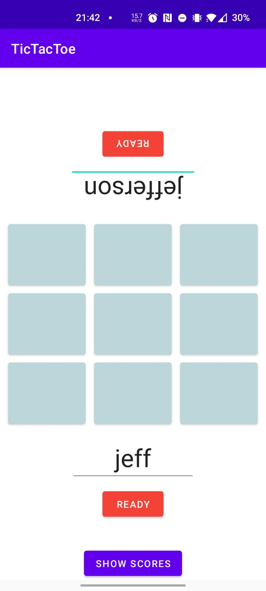
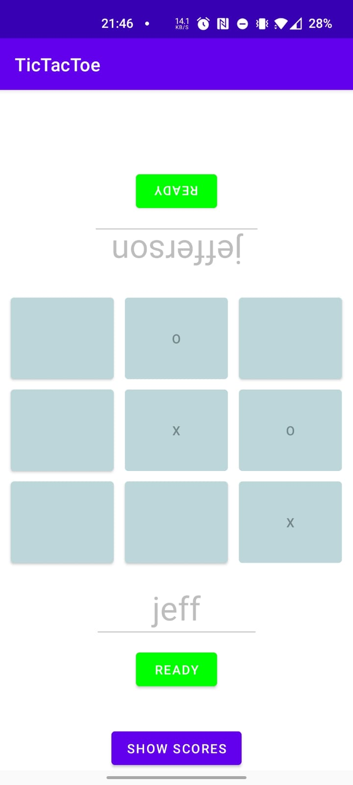
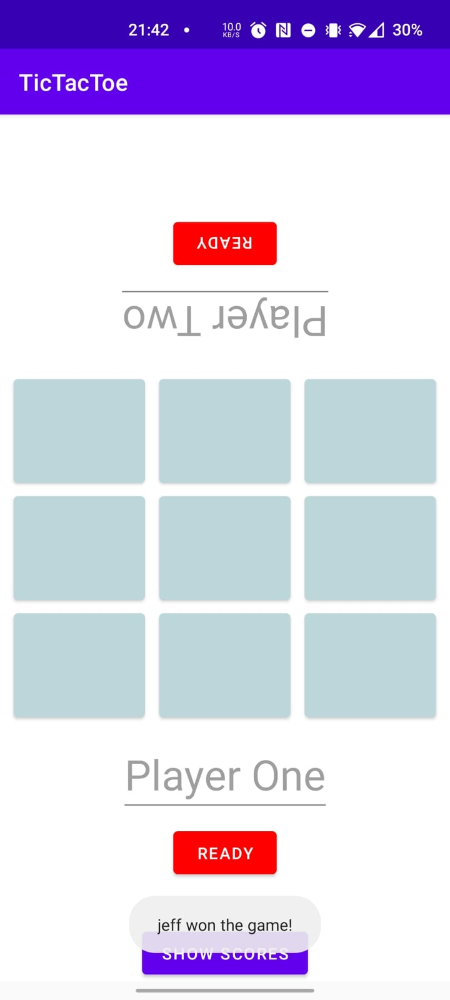
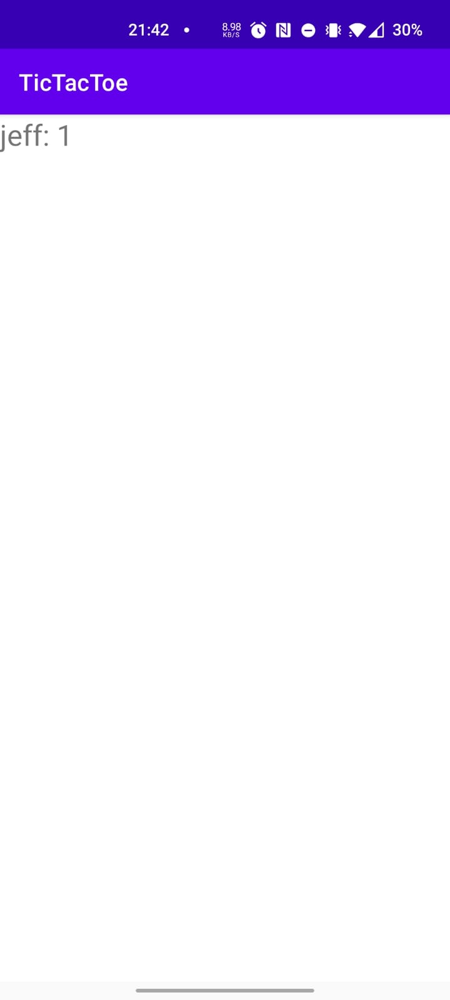

1. [Introduction](#introduction)

2. [Features](#features)
    * [UI](#ui)
        * [Starting screen](#starting-screen)
        * [Gameplay](#gameplay)
        * [Win & automatic reset](#win--automatic-reset)
        * [Scores](#scores)

# Introduction

This Tic Tac Toe app was developed for Android devices and written using Kotlin. MVC was implemented as the design pattern.
 
MVC allows me to divide and segregate the sub-areas of the app, i.e. interface (view), logic (controller/model) and data management (model). This means that if I change the view, for example, I don't have to reprogram the entire logic or the other sub-areas such as the model and controller. In most cases, only minor changes have to be made in the adjacent subarea.
 
The view implements listeners and forwards events to the controller, which then evaluates them and reacts appropriately. Notifications were implemented using toasts. The check if someone has won or if there is a tie is handled by the controller using if statements. If someone wins, his score is updated in the database in the model.  For this a function is called in the model and the username with the new points is passed. The function in the model then updates the database. After a win the application (playing field, button states, username inputs) is automatically reset.
 
A Score View displays all scores. For this, a button on the Main View is called which changes to a new view, the Score View. Activating the Score View calls the Score Activity, which then calls a function in the model that returns all scores. The Score Activity then writes the usernames and scores into the Scroll View of the Score View.
# Features

## UI

### Starting screen

### Gameplay

### Win & automatic reset

### Scores

